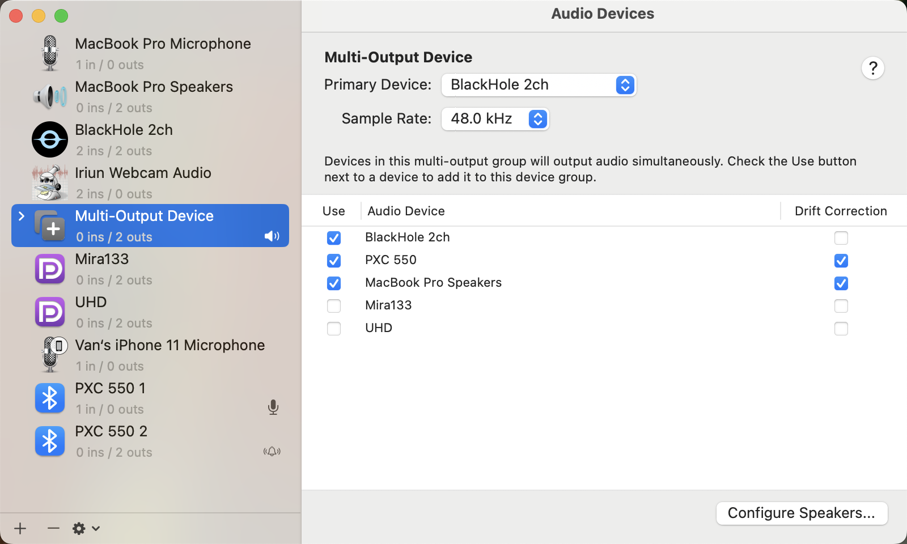

# Mac Live Subtitle

<p align="center">
  
</p>

Real-time speech-to-text and translation with a floating subtitle window for macOS. Captures audio (system output via BlackHole, or any microphone) and streams it to a cloud ASR service, then displays translated subtitles on screen — perfect for meetings, lectures, videos, and gaming.

<video src="demo/demo.mp4" width="100%" autoplay muted loop></video>

https://github.com/user-attachments/assets/2faca983-a76b-4591-95a8-5a11c1233a83


## Quick Start

```bash
# Install
brew install blackhole-2ch
git clone https://github.com/Henry-Jessie/mac-live-subtitle.git
cd mac-live-subtitle
python3 -m venv .venv && source .venv/bin/activate
pip install -r requirements.txt
cp config.ini.example config.ini

# Set API keys (get from links below)
export DASHSCOPE_API_KEY="your-key"    # Qwen3 ASR
export DEEPSEEK_API_KEY="your-key"     # translation LLM

# Run
python app.py
```

Before running, [configure audio routing](#audio-routing-setup) for system audio capture.

| API Key | Get it from | |
|:---|:---|:---|
| FunASR Realtime ASR | [DashScope China](https://bailian.console.aliyun.com/) / [DashScope Intl](https://bailian.console.alibabacloud.com/) | Region-specific endpoints & keys — see [Configuration](#configuration) |
| Translation LLM | [DeepSeek](https://platform.deepseek.com/) | Default provider |
| *Translation alternatives* | [Google AI Studio](https://aistudio.google.com/) · [OpenAI](https://platform.openai.com/) | Any OpenAI-compatible endpoint |

## Features

### Cloud-based Streaming ASR (FunASR Realtime)

No local model, no GPU required. The app streams audio to Alibaba Cloud's FunASR Realtime service over WebSocket:

- Server-side semantic sentence segmentation — each final result arrives as a complete, punctuated sentence; no client-side splitting heuristics needed
- Mandarin + Cantonese/Sichuan dialects, auto language detection, non-speech filtering, emotion recognition
- Hotword customization and context enhancement, word-level timestamps
- Optional VAD segmentation mode with tunable silence threshold for lower-latency scenarios

### Interim & Final Translation

Subtitles and translation are decoupled. While a sentence is still growing, temporary translations fire at configurable length thresholds (`funasr_interim_translate_chars`) — each translates the full current text, overwriting the previous one. A final, context-aware translation runs when the sentence ends. Interim translations never enter the translation context window.

Translation can be toggled off — then only the segmented source text is displayed (ASR-only mode).

### Context-aware Translation

A sliding context window (capped by token count) feeds recent source/translation pairs into every request, keeping terminology consistent across sentences. Powered by any OpenAI-compatible Chat Completions API (default: DeepSeek `deepseek-v4-flash`). Supports configurable temperature, a dedicated `thinking` toggle for DeepSeek V4 reasoning, extra body parameters, and reasoning-model `<think>` tag stripping.

### Single-window macOS-native UI

- Unified PyQt6 window with play/pause/stop controls
- Tabbed settings popover (Transcription / Translation / Display) with provider presets, configurable font sizes, and live preview
- Pushpin button for always-on-top, visible across all macOS Spaces via PyObjC
- Soft pause/resume (keeps WebSocket alive) and automatic reconnection with exponential backoff

<details>
<summary><h2>Audio Routing Setup</h2></summary>

To capture system audio you need [BlackHole](https://existential.audio/blackhole/) (`brew install blackhole-2ch`) and a Multi-Output Device that mirrors sound to both your speakers and BlackHole.

1. Open **Audio MIDI Setup** (in /Applications/Utilities/)
2. Click **+** → **Create Multi-Output Device**
3. Check both **BlackHole 2ch** and your output device (e.g. MacBook Pro Speakers)
4. Set **Primary Device** to **BlackHole 2ch**, sample rate **48.0 kHz**
5. Right-click the Multi-Output Device → **Use This Device For Sound Output**



> You can also skip BlackHole and point `device_index` at a physical microphone to transcribe live speech instead.

</details>

## Usage

Run `python app.py`. Use **Play** / **Pause** / **Stop** to control the pipeline, **Gear** for settings, **Pin** for always-on-top. Most settings can be changed in the settings popover; advanced settings (`extra_body`, VAD parameters) require editing `config.ini`. ASR/translation setting changes take effect after restarting the pipeline; display settings (font size) apply immediately.

## Configuration

All settings are stored in `config.ini` and can be edited either in the settings popover or by hand. Copy `config.ini.example` as a starting point:

```bash
cp config.ini.example config.ini
```

### `[transcription]` — ASR backend

| Key | Description | Default |
|:---|:---|:---|
| `backend` | `funasr_realtime` (currently the only supported backend) | `funasr_realtime` |
| `source_language` | Language hint (`auto` = auto-detect; maps to `language_hints`, e.g. `zh`, `en`, `ja`) | `auto` |
| `funasr_realtime_model` | FunASR model name | `fun-asr-realtime` |
| `funasr_realtime_ws_url` | WebSocket endpoint — standard: `wss://dashscope.aliyuncs.com/api-ws/v1/inference`, workspace-specific: `wss://{WorkspaceId}.cn-beijing.maas.aliyuncs.com/api-ws/v1/inference` (Beijing and Singapore API keys are region-specific and not interchangeable) | Beijing endpoint |
| `funasr_realtime_api_key_env` | Env var name holding the API key | `DASHSCOPE_API_KEY` |
| `funasr_realtime_api_key` | API key value directly (takes precedence over env var) | *(empty)* |
| `funasr_realtime_semantic_punctuation` | Server-side semantic sentence segmentation (accurate boundaries, longer segments). `false` = VAD segmentation (lower latency) | `true` |
| `funasr_realtime_max_sentence_silence` | VAD silence threshold in ms (200–6000, server default 1300; `0` = omit). VAD mode only | `0` |
| `funasr_realtime_multi_threshold` | Prevent VAD from producing over-long sentences. VAD mode only | `false` |
| `funasr_interim_translate_chars` | Interim translations: fire a temporary translation each time a growing sentence's display length crosses another multiple of this value (CJK chars count 2; `0` = disable) | `40` |
| `funasr_realtime_event_log` | Optional JSONL file logging raw sentence events (interim/end with timestamps) | *(empty)* |

### `[translation]` — LLM translation

| Key | Description | Default |
|:---|:---|:---|
| `base_url` | OpenAI-compatible API endpoint | `https://api.deepseek.com/v1` |
| `api_key_env` | Env var name holding the API key (see below) | `DEEPSEEK_API_KEY` |
| `api_key` | API key value directly (takes precedence over `api_key_env`) | *(empty)* |
| `model` | Model identifier | `deepseek-v4-flash` |
| `target_lang` | Target language for translation | `Simplified Chinese` |
| `enabled` | Enable translation (`true`/`false`). When `false`, only segmented source text is shown | `true` |
| `thinking` | DeepSeek V4 thinking mode: `false` = disabled, `true` = enabled, `auto` = omit the parameter (use for non-DeepSeek providers) | `false` |
| `temperature` | Sampling temperature | `1.0` |
| `extra_body` | Extra JSON merged into API calls (e.g. `{"thinking": {"type": "disabled"}}`) | *(empty)* |

> **API key resolution**: the app looks up the key in this order: `api_key` in config (literal value) → environment variable named by `api_key_env`. In the settings UI, you can type either a raw key (`sk-...`) or an env var reference prefixed with `$` (e.g. `$DEEPSEEK_API_KEY`), and the app will store it accordingly.

### `[audio]` / `[display]`

| Key | Section | Description | Default |
|:---|:---|:---|:---|
| `device_index` | audio | `auto` (detect BlackHole) or a specific device index | `auto` |
| `sample_rate` | audio | Sample rate in Hz | `16000` |
| `streaming_step_size` | audio | Audio frame duration in seconds | `0.2` |
| `always_on_top` | display | Start with window pinned on top | `true` |
| `original_font_size` | display | Font size (px) for source text | `13` |
| `translated_font_size` | display | Font size (px) for translated text | `17` |

## Troubleshooting

<details>
<summary><b>No audio captured</b></summary>

- Run `python core/audio_capture.py` to list devices and test capture
- Ensure BlackHole is installed and Multi-Output Device is set as system output
- Check `device_index = auto` in `config.ini` (or set the correct index manually)
</details>

<details>
<summary><b>ASR not connecting</b></summary>

- Verify your API key environment variable is exported
- FunASR returns a `task-failed` event with `error_code`/`error_message` for auth or parameter problems; check the console for `[FunASR]` logs
- The app retries up to 6 times with exponential backoff
</details>

<details>
<summary><b>Translation not appearing</b></summary>

- Confirm `[translation] base_url`, `api_key_env`, and `model` are set correctly
- The env var named in `api_key_env` must be exported (e.g. `export DEEPSEEK_API_KEY=...`)
- Check the console for `[Translator]` error logs
</details>

<details>
<summary><b>High latency</b></summary>

- Try a faster translation model (e.g. DeepSeek V4 Flash non-thinking or Gemini Flash)
- Reduce `streaming_step_size` for more frequent audio frames
- For lower-latency sentence boundaries, switch to VAD mode (`funasr_realtime_semantic_punctuation = false`) and lower `funasr_realtime_max_sentence_silence`
</details>

## How It Works

The pipeline has three concurrent stages:

1. **Audio capture** — opens the configured input device via `sounddevice` (16 kHz mono, configurable step size; falls back to stereo + downmix on devices that reject mono). Auto-detects a usable BlackHole device by default; any input device can be selected via `device_index`.

2. **Streaming ASR** — the FunASR backend opens a duplex WebSocket to DashScope (`run-task` → binary PCM16 frames → `result-generated` events). Each event carries the full text of the current sentence: interim results replace the live subtitle line, and `sentence_end` commits the sentence verbatim. No client-side segmentation.

3. **Translation & display** — committed sentences are translated by the LLM endpoint (sliding context window) on a single serial executor, so interim and final translations can never arrive out of order. Growing sentences fire temporary translations at length thresholds; the final translation overwrites them. Results reach the UI via pipeline-identity-guarded Qt signals and appear as timestamped original/translation pairs with follow-tail auto-scroll.

---

## Privacy & Data Flow

> **All data is cloud-processed.** Audio is streamed to a cloud ASR service; transcribed text is sent to an external LLM for translation. No data stays local. Be mindful of this in sensitive contexts — speech content passes through third-party servers subject to their privacy policies. An active internet connection is required.

## Roadmap

- **Native macOS rewrite** — ScreenCaptureKit system-audio capture (no BlackHole), AppKit floating subtitle panel, Keychain-stored keys, signed & notarized `.app`

## Acknowledgments

Inspired by and forked from [Real-Time Translator](https://github.com/Vanyoo/realtime-subtitle) by Van (local ASR + dashboard/overlay architecture). This project replaces local ASR with cloud streaming, and consolidates the UI into a single macOS-native window.

## License

MIT
