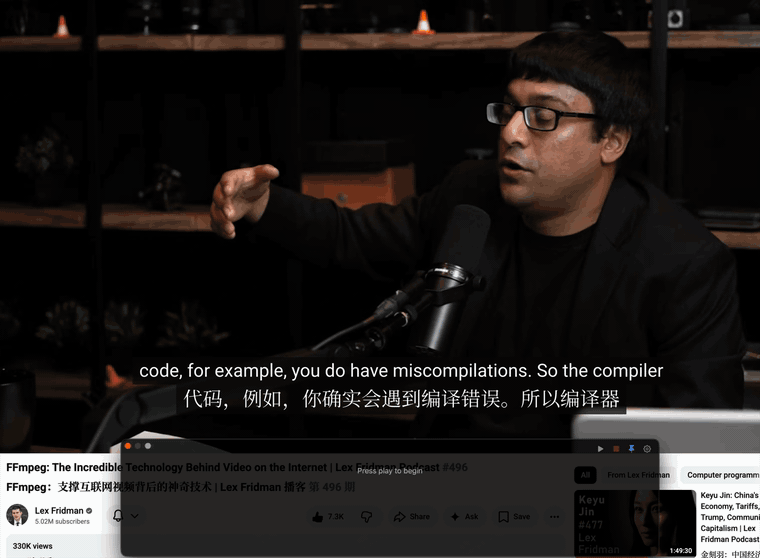
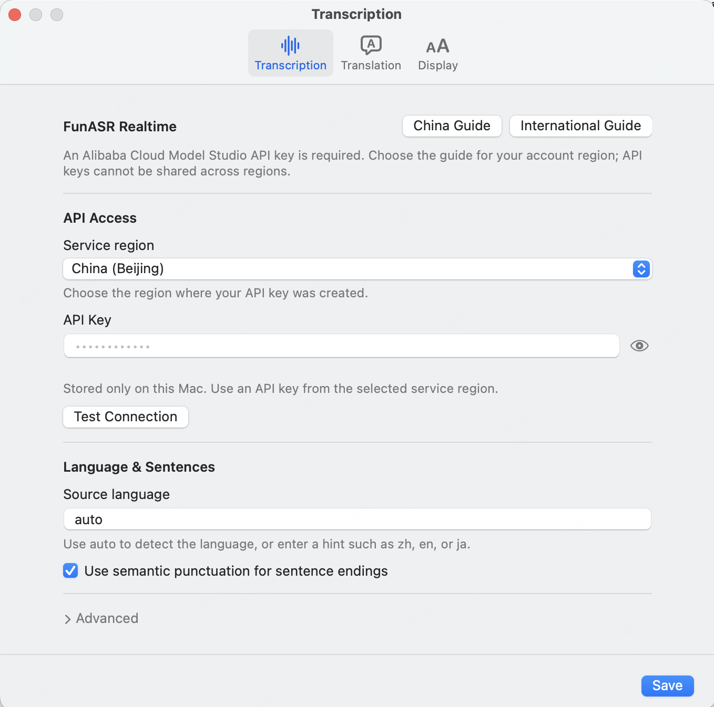

# Mac Live Subtitle

[English](README.md) | 简体中文

<p align="center">
  
</p>

<p align="center">
  <a href="https://github.com/Henry-Jessie/mac-live-subtitle/releases/latest"></a>
  
  
  <a href="LICENSE"></a>
</p>

Mac Live Subtitle 是一款原生 macOS 菜单栏实时字幕应用，可以识别系统音频并
按需翻译。悬浮字幕窗口可以显示在会议、课程、视频和游戏上方。

### [下载最新版本 →](https://github.com/Henry-Jessie/mac-live-subtitle/releases/latest)

要求 **macOS 13 或更高版本**和 **Apple Silicon Mac**。原生捕获不需要安装
Python、BlackHole、多输出设备或本地 GPU。Apple TV 等受保护播放器可以使用
BlackHole 兼容模式。

<p align="center">
  
</p>

## 主要功能

- 原生 AppKit 菜单栏应用和悬浮字幕窗口。
- 支持 ScreenCaptureKit 原生音频捕获和可选的 BlackHole 兼容模式。
- FunASR Realtime 流式识别，支持中间结果和最终结果。
- 可选 DeepSeek、Gemini 或兼容 OpenAI 接口的自定义翻译服务。
- 支持播放、暂停、停止、置顶、透明度、字号和中英文设置界面。

## 演示

<p align="center">
  
</p>

## 安装

1. 从 [GitHub Releases](https://github.com/Henry-Jessie/mac-live-subtitle/releases/latest)
   下载最新的 macOS arm64 ZIP。
2. 解压后，将 **Mac Live Subtitle.app** 移入 `/Applications`。
3. 尝试打开一次应用。macOS 可能阻止首次启动。
4. 打开“**系统设置 → 隐私与安全性**”，滚动到“安全性”，找到
   Mac Live Subtitle 后点击“**仍要打开**”。
5. 再次打开应用。菜单栏图标和字幕窗口会显示，但不会自动开始捕获。

## 配置

从菜单栏菜单或字幕窗口右上角的齿轮按钮打开“设置”。

### 语音识别

FunASR Realtime 需要阿里云百炼 API Key：

- [国内 API Key 申请文档](https://help.aliyun.com/zh/model-studio/get-api-key)
- [国际站 API Key 申请文档](https://www.alibabacloud.com/help/en/model-studio/get-api-key)

在“**设置 → 识别**”中选择“中国（北京）”或“国际（新加坡）”，然后填写同一
地域的 API Key，应用会自动使用对应的 WebSocket 地址。高级设置可以调整分句和
音频捕获方式。中间结果由应用自动安排翻译，完整句会立即提交翻译。

### 字幕翻译

翻译功能可以关闭。选择目标语言和一个服务：

- [DeepSeek](https://platform.deepseek.com/api_keys)
- [Gemini](https://aistudio.google.com/app/apikey)
- **自定义**：填写兼容 OpenAI 接口的基础地址和模型名称。

填写对应 API Key，并在保存前使用“测试连接”。关闭翻译后，原文字幕仍会显示。

识别、翻译、服务区域和音频捕获设置将在下次开始捕获时生效；字幕字号、透明度和
置顶设置会立即生效。

<p align="center">
  
</p>

<p align="center">
  
  
</p>

## 使用

点击“播放”开始捕获。原生捕获需要在以下位置允许 Mac Live Subtitle：

**系统设置 → 隐私与安全性 → 屏幕与系统音频录制**

修改权限后需要完全退出并重新打开应用。

BlackHole 兼容模式使用“麦克风”权限，因为 macOS 将虚拟输入设备归入麦克风。

| 控件 | 功能 |
|:--|:--|
| 播放／暂停 | 开始、暂停或继续当前会话 |
| 停止 | 关闭当前识别和翻译会话 |
| 置顶 | 让字幕窗口显示在其他窗口上方 |

拖动字幕窗口顶部区域可以移动窗口，拖动边缘或四角可以调整大小。关闭字幕窗口
只会将其隐藏；从菜单栏菜单选择“字幕窗口”即可重新显示。

## 隐私

- 系统音频会发送到阿里云 FunASR。启用翻译后，识别文本会发送到选择的翻译服务。
- 默认不保存字幕。只有主动启用 FunASR 事件日志时，原文才会写入本地文件。
- API Key 以本地明文保存在
  `~/Library/Application Support/Mac Live Subtitle/credentials.json`。
  目录权限为 `0700`，文件权限为 `0600`；同一 macOS 用户下运行的其他进程
  仍有可能读取它。
- 应用不会读取或修改已有钥匙串项目。

## 常见问题

<details>
<summary><b>开始识别后 Apple TV 画面变黑</b></summary>

受保护的 Apple TV 视频会在 ScreenCaptureKit 工作时隐藏。如需在识别期间保持
Apple TV 画面可见，请安装
[BlackHole 2ch](https://github.com/ExistentialAudio/BlackHole)，创建同时包含
内置输出和 BlackHole 的多输出设备，将内置输出设为主设备，然后在 macOS 中将该
多输出设备设为声音输出，再在“**设置 → 识别 → 高级设置**”中选择“BlackHole
兼容模式”。使用结束后，将 macOS 声音输出切回原来的设备。应用每次启动捕获时
都会重新检测 BlackHole，不会保存设备编号。

</details>

<details>
<summary><b>已经打开权限，但仍然无法捕获</b></summary>

确认权限授予的是 **Mac Live Subtitle.app**，而非终端或源码 Python 进程。
修改权限后完全退出应用，再从 `/Applications` 重新打开。

</details>

<details>
<summary><b>FunASR 无法连接</b></summary>

检查“**设置 → 识别**”中的 API Key 和服务区域。不同地域的 API Key 不能混用。

</details>

<details>
<summary><b>没有显示翻译</b></summary>

确认已经启用翻译、当前服务填写了 API Key，并填写了目标语言。使用自定义服务时，
还需要填写高级设置中的基础地址和模型名称。

</details>

<details>
<summary><b>分句太长</b></summary>

关闭语义标点以使用 VAD 分句，然后降低最长静音时间。多阈值 VAD 可以进一步限制
长句；中间结果翻译可以在最终句子结束前提前更新译文。

</details>

## 开发

源码开发需要 macOS、Python 3.10 或更高版本，以及
[uv](https://docs.astral.sh/uv/)：

```bash
git clone https://github.com/Henry-Jessie/mac-live-subtitle.git
cd mac-live-subtitle
uv sync --group build
uv run python app.py
uv run python -m unittest discover -s tests
```

发行维护者可以运行 `./scripts/package_release.sh 0.1.0` 完成构建、签名、
压缩和校验；本机需要已经配置相应的签名身份。

## 致谢

项目最初受 Van 的
[Real-Time Translator](https://github.com/Vanyoo/realtime-subtitle) 启发并由其派生。

## 许可证

[MIT](LICENSE)
