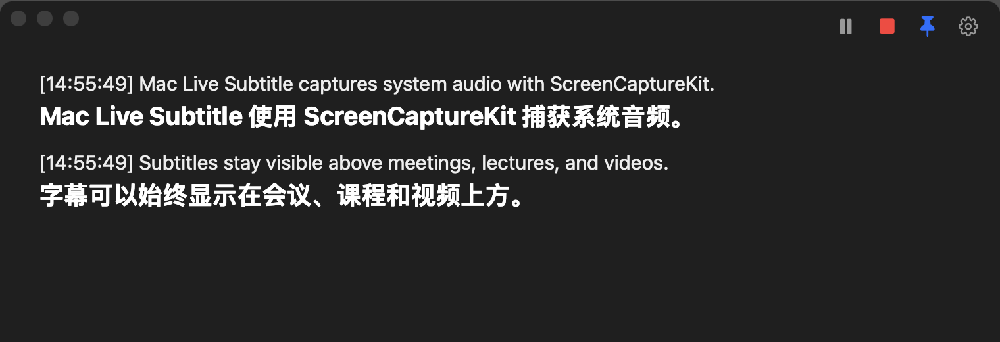
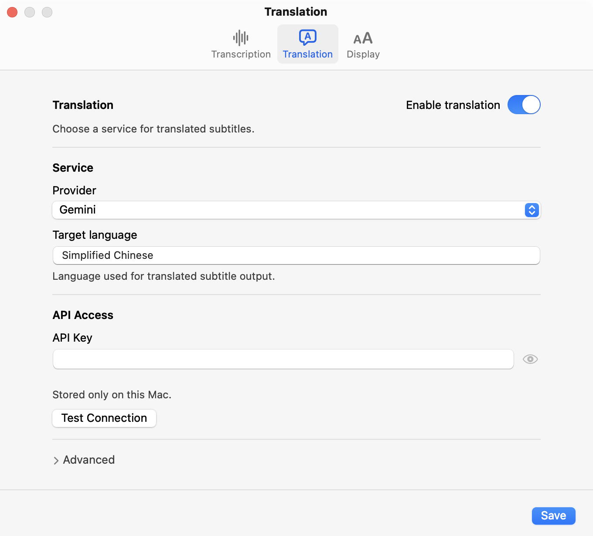
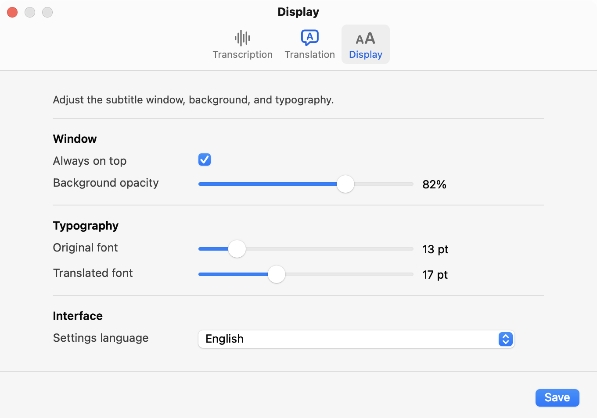

# Mac Live Subtitle

[English](README.md) | 简体中文

<p align="center">
  
</p>

<p align="center">
  <a href="https://github.com/Henry-Jessie/mac-live-subtitle/releases/latest"></a>
  
  
  <a href="LICENSE"></a>
</p>

Mac Live Subtitle 是一款原生 macOS 菜单栏实时字幕应用。它通过
ScreenCaptureKit 直接捕获系统音频，使用 FunASR Realtime 进行流式识别，
并可调用 DeepSeek、Gemini 或自定义接口翻译字幕。悬浮字幕窗口适合会议、
课程、视频和游戏。

### [下载最新版本 →](https://github.com/Henry-Jessie/mac-live-subtitle/releases/latest)

打包版本要求 **macOS 13 或更高版本**和 **Apple Silicon Mac**。使用时不需要
安装 Python、BlackHole、多输出设备或本地 GPU。

<p align="center">
  
</p>

## 主要功能

- 原生 AppKit 菜单栏应用，不显示 Dock 图标。
- 使用 ScreenCaptureKit 直接捕获系统音频。
- FunASR Realtime 流式识别，支持中间结果和最终结果。
- 可选 DeepSeek、Gemini 或兼容 OpenAI 接口的自定义翻译服务。
- 黑色悬浮字幕窗口，提供播放、暂停、停止、置顶和设置控件。
- 可调整背景透明度，并分别设置原文和译文字号。
- 设置界面支持中文和英文。
- API Key 保存在本机，不会触发钥匙串授权弹窗。

## 安装

1. 从 [GitHub Releases](https://github.com/Henry-Jessie/mac-live-subtitle/releases/latest)
   下载 `Mac-Live-Subtitle-v0.1.0-macos-arm64.zip`。
2. 解压后，将 **Mac Live Subtitle.app** 移入 `/Applications`。
3. 尝试打开一次应用。当前版本使用自签名证书且未经过 Apple 公证，macOS
   可能阻止首次启动。
4. 打开“**系统设置 → 隐私与安全性**”，滚动到“安全性”，找到
   Mac Live Subtitle 后点击“**仍要打开**”。
5. 再次打开应用。菜单栏会出现应用图标，字幕窗口会显示，但不会自动开始捕获。

Release 页面同时提供 `SHA256SUMS.txt`，可在安装前校验下载文件：

```bash
shasum -a 256 -c SHA256SUMS.txt
```

## 配置服务

从菜单栏菜单或字幕窗口右上角的齿轮按钮打开“设置”。

### 语音识别

FunASR Realtime 需要阿里云百炼 API Key：

- [国内 API Key 申请文档](https://help.aliyun.com/zh/model-studio/get-api-key)
- [国际站 API Key 申请文档](https://www.alibabacloud.com/help/en/model-studio/get-api-key)

在“**设置 → 识别**”中填写 API Key。API Key 和 WebSocket 地址必须属于
同一个阿里云地域。设置页面中的“国内申请教程”和“国际申请教程”会打开相同文档。

语义标点通常能得到更自然的句子边界，但分句可能更长。高级设置还提供 VAD
分句、最长静音、多阈值 VAD 和中间结果翻译间隔。

### 字幕翻译

翻译功能可以关闭。在“**设置 → 翻译**”中选择服务：

- **DeepSeek**：使用预设的 DeepSeek OpenAI 兼容接口；
  [申请 API Key](https://platform.deepseek.com/api_keys)。
- **Gemini**：使用预设的 Gemini OpenAI 兼容接口；
  [在 Google AI Studio 申请 API Key](https://aistudio.google.com/app/apikey)。
- **自定义**：填写兼容接口的基础地址和模型名称。

选择目标语言、填写对应 API Key，并在保存前使用“测试连接”。关闭翻译后，
原文字幕仍会正常显示。

<p align="center">
  
  
</p>

## 使用

点击字幕窗口中的“播放”按钮开始捕获。首次使用时，允许 macOS 的系统音频权限。
如果此前拒绝过权限，请在以下位置启用 Mac Live Subtitle：

**系统设置 → 隐私与安全性 → 屏幕与系统音频录制**

修改权限后需要完全退出并重新打开应用。

| 控件 | 功能 |
|:--|:--|
| 播放／暂停 | 开始捕获、暂停当前会话或继续会话 |
| 停止 | 关闭当前识别和翻译会话 |
| 置顶 | 让字幕窗口始终显示在其他窗口上方 |
| 设置 | 打开识别、翻译和显示设置 |

拖动字幕窗口顶部区域可以移动窗口，拖动边缘或四角可以调整大小。关闭字幕窗口
只会将其隐藏；从菜单栏菜单选择“字幕窗口”即可重新显示。

## 隐私与数据流

- 系统音频会发送到配置的阿里云 FunASR 服务。
- 启用翻译后，识别文本会发送到当前选择的翻译服务。
- 默认不保存字幕。只有主动启用 FunASR 事件日志时，原文才会写入本地文件。
- API Key 保存在
  `~/Library/Application Support/Mac Live Subtitle/credentials.json`。
  目录仅限当前 macOS 用户访问，文件权限为 `0600`。
- 凭据文件是本地明文文件，同一 macOS 用户下运行的其他进程可能读取它。
- 应用不会读取或修改已有钥匙串项目。

## 常见问题

<details>
<summary><b>应用无法打开</b></summary>

先尝试打开一次，然后前往“**系统设置 → 隐私与安全性**”，点击“**仍要打开**”。
当前公开版本使用固定的自签名证书，便于 macOS 识别后续更新，但尚未经过 Apple
公证。

</details>

<details>
<summary><b>已经打开系统音频权限，但仍然无法捕获</b></summary>

确认权限授予的是 **Mac Live Subtitle.app**，而非终端或源码 Python 进程。
修改权限后完全退出应用，再从 `/Applications` 重新打开。

</details>

<details>
<summary><b>FunASR 无法连接</b></summary>

检查“**设置 → 识别**”中的 API Key 和 WebSocket 地址。不同地域的 API Key
不能与其他地域的地址混用。连接和服务端错误会显示在字幕窗口的提示栏中。

</details>

<details>
<summary><b>没有显示翻译</b></summary>

确认已经启用翻译、当前服务填写了 API Key，并填写了目标语言。使用自定义服务时，
还需要检查高级设置中的基础地址和模型名称。

</details>

<details>
<summary><b>分句太长</b></summary>

关闭语义标点以使用 VAD 分句，然后降低最长静音时间。多阈值 VAD 可以进一步限制
异常长句；中间结果翻译可以在最终句子尚未结束时提前更新译文。

</details>

## 从源码运行

源码开发需要 macOS、Python 3.10 或更高版本，以及
[uv](https://docs.astral.sh/uv/)：

```bash
git clone https://github.com/Henry-Jessie/mac-live-subtitle.git
cd mac-live-subtitle
uv sync --group build
uv run python app.py
```

源码版本和打包版本使用相同的 `NSUserDefaults` 设置域和本地凭据文件。原有
`config.ini` 只会在第一次启动原生版本时导入一次，应用不会回写该文件。

运行测试：

```bash
uv run python -m unittest discover -s tests
```

## 构建发行包

项目通过 py2app 打包，并使用固定的本地签名身份。发行脚本会清理旧构建、
生成应用、完成签名与校验、创建 macOS ZIP 和 SHA-256 文件，然后解压并再次
校验应用：

```bash
./scripts/package_release.sh 0.1.0
```

产物位于 `release/v0.1.0/`。默认签名身份是
`Mac Live Subtitle Local Signing`，也可以通过 `CODESIGN_IDENTITY` 修改。

当前公开版本只支持 Apple Silicon。Developer ID 签名和 Apple 公证不属于
`v0.1.0` 的发布范围。

## 工作原理

1. **音频捕获**：ScreenCaptureKit 输出长度不固定的系统音频采样，捕获层将其转换为
   16 kHz 单声道 PCM 帧。
2. **流式识别**：FunASR Realtime 通过 WebSocket 接收 PCM 音频。中间事件更新当前行，
   最终事件提交完整句子。
3. **翻译与显示**：串行翻译执行器将已提交的文本和有限长度的上下文发送到翻译服务，
   再把界面更新切回 AppKit 主线程。

## 致谢

项目最初受 Van 的
[Real-Time Translator](https://github.com/Vanyoo/realtime-subtitle) 启发并由其派生。
Mac Live Subtitle 使用云端流式识别、ScreenCaptureKit 和原生 AppKit 菜单栏应用，
替换了原项目的本地识别与 PyQt 界面。

## 许可证

[MIT](LICENSE)
